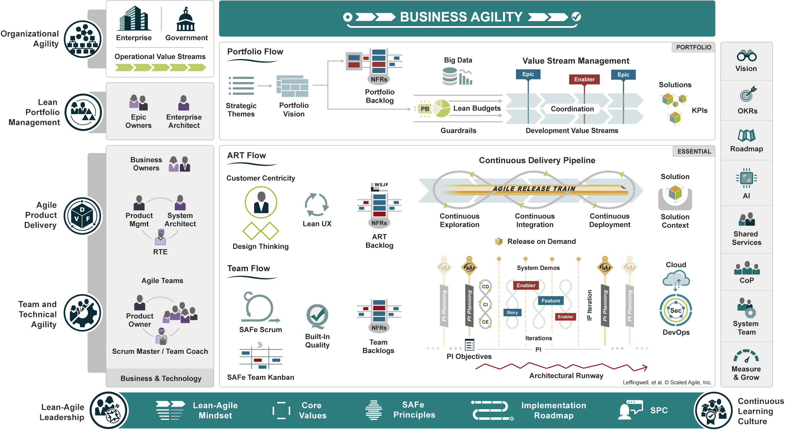

+++
title = "migrating-to-SAFe"
outputs = ["Reveal"]
[reveal_hugo]
theme = "night"
margin = 0.2
transition = "slide"
transition_speed = "fast"
+++

{}

## Migrating to Scaled Agile Framework

<b> (SAFe) </b>

An anecdotal story
  
By: Russ Harrington

{}

---

## Outline

- Scaled Agile Framework
- Project Background
- Migration to Agile
- Migration to Scaled Agile
- Scaled Agile Framework in Action
- Lessons Learned
- References

---

### Scaled Agile Framework

<a href="https://scaledagileframework.com/" target="_blank" >https://scaledagileframework.com/</a>

---

{}



---



---

## Disclaimer

All opinions in the following presentation are explicitly my own and do not necessarily represent the opinions of any company that I may have, or currently work for.

---

## Project Background

---



### Project Size

- Incredibly large System of Systems!
- Thousands of engineers (Software, Systems, Test, Hardware, etc...)
- Dozens and dozens of customers
- 10s of millions of lines of source code alone.

---

### Why Migrate From Waterfall

- The waterfall model took a year or more to get capability to the customer
- Incredibly expensive when finding defects during validation testing
- Feedback loop took too long to adapt to change in priorities
- Rapid Changing landscape of technology and customer needs

{}

---

{}

## Migration to Agile

---


### Step 1: Training

- Project wide training blitz
- Covered agile principles and tools
- Full week of workshops
- 10-20% of Engineering and Management trained per week (8 weeks total)
- Massive initiative requires buy-in from top down

---



### Step 2: Adopting Tools

- Jira adoption for workflow
- Confluence adoption for documentation
- Bitbucket for GitOps
- CI/CD tools

---



### Step 3: Team Transitions

- Project is grouped by functional domains
- Functional domain teams self-organized
  - Option to adopt Kanban or Scrum
  - Team formation and charters
  - DevOps or core-competencies
- 1-2 years of adoption across the project

---



### Now What????

Individual teams were now planning and executing work in more agile approach

{} Hardly improved the speed to customer{}
{} Feed back loops still too long{}
{} Requirements still very much waterfall{}
{} Validation still planned for big bang deliveries{}
{} Teams very resistant to change, change fatigue{}

{}**Leadership** realized a more structured approach to a project of this size was needed.{}

{}

---

{}

## Migration to Scaled Agile

---



### Team Re-Organization and First Few Releases

{}\- Still domain driven teams but organized into DevOps like teams{}
{}\- Each domain appointed a Release Train Engineer{}
{}\- Coordinated 2 week sprints across all teams{}
{}\- Release planning events established{}
  {}&nbsp;&nbsp;\- 3 month releases{}
  {}&nbsp;&nbsp;\- Backlog established for 6 months{}
  {}&nbsp;&nbsp;\- All sprints planned to 80% capacity{}
{}\- Stakeholder buy-in on team plans{}
{}\- Cross team dependency boards{}

---



### Time for Reflection

{}\- Process still too rigid for changing priorities{}
{}\- Impossible for stakeholders to attend all individual team demos{}
{}\- Lots of fall-over due to capacity planning{}
{}\- Teams still not bought in{}

---



### Round 2: Electric Boogaloo or Great Success?

{}\- Sprint planning only to the next few sprints{}
{}\- Continual backlog refinement{}
{}\- Combined team demos{}
{}\- RTE coordination events stood up{}
{}\- Customer coordination events to agree on priorities{}
{}\- Coordinated requirements and development{}
  {}&nbsp;&nbsp;\- Just in time requirements where applicable{}
  {}&nbsp;&nbsp;\- Capability threads as opposed to full delivery{}

---



### Reflection on Round 2

{}\- Teams able to complete more of planned scope{}
{}\- Still need to incorporate validation in team activity{}
{}\- More awareness across both teams and customers{}
{}\- Priority shifting still causing churn{}
  {}&nbsp;&nbsp;\- Invisible or Unplanned Work{}
  {}&nbsp;&nbsp;\- Popup still a killer{}
{}\- Reoccurring events (test event support) does not fit well into sprints{}

---



### Round N: Continual Learning

{}\- Project wide retrospective collections{}
{}\- Evolution and Technology teams{}
{}\- Even more coordination{}
{}\- Continual trim of unnecessary process{}
{}\- Less rigid releases, reduce release time{}
{}\- Validation built into release cycle (shift left){}
{}\- Evolution of the release train{}

---

### How Scaled Agile Fits

{}\- Promotes continuous learning{}
{}\- Well groomed domain backlogs across the entire project{}
{}\- Continuous releases, full project release 12+ times a year{}
{}\- Agile across all engineering disciplines{}
{}\- Support from coaches{}
{}\- Engagement with customer across whole product lifecycle{}

{}

---

{}

## Lessons Learned

---



### Change Is Hard

{}\- Develop a change management plan{}
{}\- Avoid change fatigue{}
{}\- Need to accept that it may not go well at first{}
{}\- Leadership buy-in is essential{}
{}\- This may be a culture change!{}

---



### Incremental Progress

{}\- Don't try to big bang SAFe{}
{}\- Make small changes at first{}
{}\- Focus on continual learning{}
{}\- Start with teams, and keep them healthy{}

---



### Framework Approach

{}\- SAFe can be a very large scale approach, find what fits and adapt{}
{}\- Focus on value, eliminate waste{}
{}\- Its more than just software development{}
{}\- Use established tools, don't re-invent the wheel{}

---



### Benefits

{}\- Once the kinks are worked out, it really shines{}
{}\- It is a culture change tool{}
{}\- For large projects this can be a huge enabler{}
{}\- Visibility across the whole project{}
{}\- Constant value mapping of the process, eliminates waste{}
{}\- Has workflows and resources for all things agile{}

{}

---



## Thank you

         
